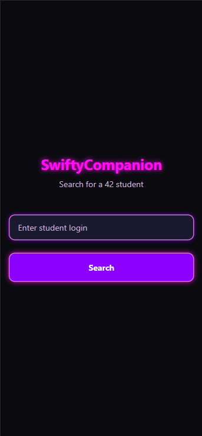
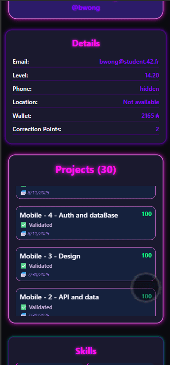

# SwiftyCompanion

Welcome to **SwiftyCompanion**, the app that stalks(?!) 42 students so you don't have to! 🎯

## What is this? 🤔

A sleek, neon-powered app to search for 42 student profiles, flex their skills, and marvel at their projects. Think of it as LinkedIn, but cooler and with fewer recruiters.

## Features 🌟

- 🔍 **Search**: Find your favorite 42 student (or nemesis).
- 📜 **Profiles**: See their skills, projects, and more.
- 🎨 **Neon Vibes**: Because dark mode is too mainstream.

## Tech Stack 🛠️

- **React Native**: For building a cross-platform app.
- **Expo**: To streamline development and testing.
- **TypeScript**: Because type safety is cool.
- **OAuth2**: For secure authentication with the 42 API.

## How to Run 🏃‍♂️

1. Clone this repo (you know the drill).
2. Add your 42 API credentials to `.env` (or just stare at the app doing nothing).
3. Run `npx expo start` and let the magic happen.

## Disclaimer ⚠️

We are not responsible for any existential crises caused by comparing your profile to others. Use responsibly. 😅

---

Made with 💻, ☕, and a touch of

## Preview

 
